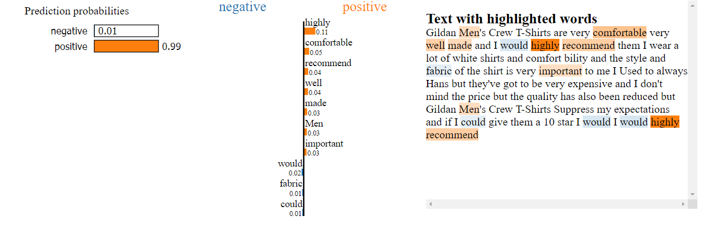
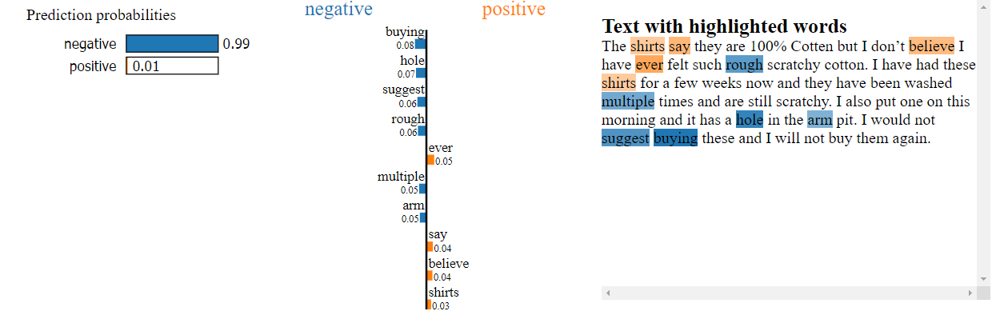

# Amazon Review Sentiment Analysis
Abeselom Fanta Flex 20 Weeks Instructor: Abhineet Kulkarni

## Business Understanding
Sentiment analysis is one the of the most important tasks to understand user satisfaction. Most websites that offer products and services have various means of keeping track of user satisfaction criteria, such as stars-based system. However, most users are disincentivized to provide accurate rating for the products or services they purchased. In addition, manually sorting through users’ comments to determine if the comments left by users/clients is positive or negative takes a lot of work. Therefore, the problem necessitates an automated way to determine sentiment analysis of clients.

## Data Understanding
The data used in this project was obtained from [Kaggle](https://www.kaggle.com/datasets/bittlingmayer/amazonreviews/code?datasetId=1305). The dataset contains four million comments (3.6 million training and 0.4 million test datasets). The files are presented in [fastText]( https://fasttext.cc/) format, which will be parsed to the required type of data for processing. Both the training and test datasets are labeled, which will help in quantify how the predictions measure with true labels.

## Model Selection
The text in the training data was de-contracted (`isn't` converted to `is not`). Email address and website URLs were filtered. Misspelled words were replaced by their closest approximated word (`caracters` replaced by `characters`). The text was then vectorized using TfIdf, Count and GloVe word embedding vectorizers for model fitting. The vectorized data were then fitted to a grid of shallow models (naïve Bayes, logistic regression and random forest) and gradient boosting models (XGBoost and CatBoost).

For deep learning approaches, Long Short Term Memory (LSTM) models with and without word embedding were considered. In addition, a Convolutional Neural Network (CNN) model with Bidirectional Encoder Representations from Transformers (BERT) tokenization was used as an alternative to transformer models. LSTM model performed the best with over 94.8% accuracy over training and 92.3% accuracy on validation and 91.4% accuracy on test datasets.  

## Model Prediction 
The model was able to make predictions over unseen data taken from a random product page on Amazon, highlighting probabilities to words in a given sentence. 





## Word Frequency 
Predictions from the final model were used to display the word frequency. The 50 most frequent words in the true positive and true negative are shown as follows.


## Conclusion 
We built a binary text classification model LSTM that is able to perform Amazon reviews sentiment analysis with 91.4% accuracy. 
Our model was also able to assign probabilistic ratio for each word used from a completely unseen review. Word Clouds were generated to show which words are the appear the most in both true positive and negative reviews. It was also observed that LSTM with GloVe and BERT tokenized models also performed strongly. More deep learning architectures could be considered to improve the accuracy of test data. 


## Next Steps
The next steps include considering more robust models (layers with larger nodes) for an improved performance. Also, in this project I was aspired to implement transformer models which have significantly higher performance compared to the traditional LSTM model. The dataset used in this project have binary classes. It would be interesting to test the model performance on a star-based rating, instead of positive or negative reviews. 

## For More Information

See the full analysis in the [Jupyter Notebook](./index.ipynb) or review this [presentation](./presentation.pdf).

For additional info, contact the author at [afanta@alumni.cmu.edu](mailto:afanta@alumni.cmu.edu)

## Repository Structure

```
├── images
├── data
├── models
├── static
├── template
├── README.md
├── presentation.pdf
└── index.ipynb
